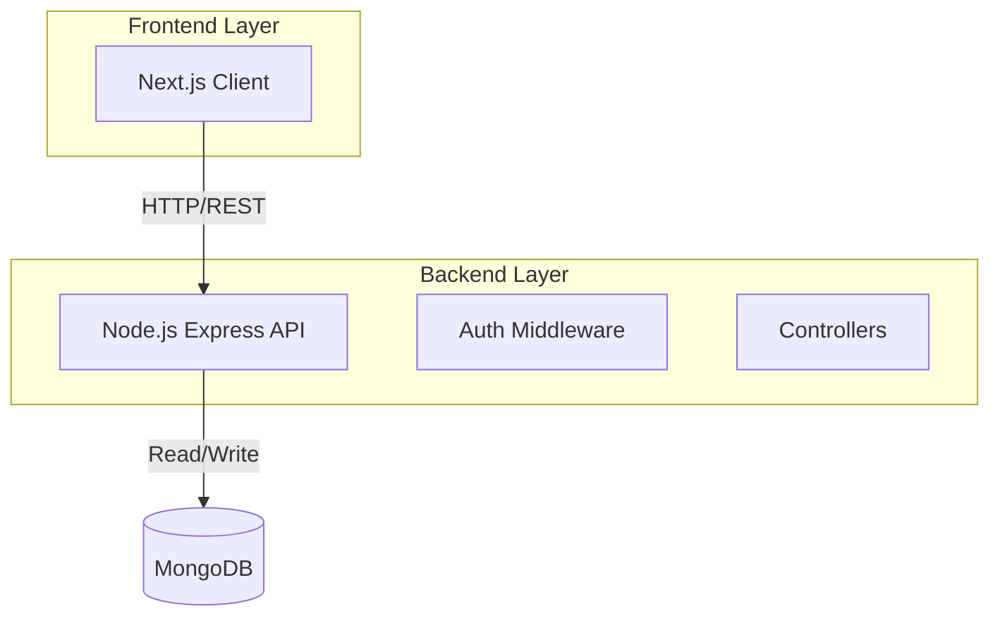

<div align="center">

# 🏬 Digital Mall OS

### The Operating System for Modern Retail Spaces

[](https://nextjs.org/)
[](https://www.typescriptlang.org/)
[](https://nodejs.org/)
[](https://www.mongodb.com/)
[](https://tailwindcss.com/)
[](./LICENSE)

[**Product Vision**](./PRODUCT_VISION.md) • [**Architecture**](./ARCHITECTURE.md) • [**Roadmap**](./FEATURES_ROADMAP.md)

</div>

---

## 🚀 Overview

**Digital Mall OS** is the centralized nervous system for modern shopping centers. It bridges the gap between the physical and digital worlds, transforming passive brick-and-mortar malls into data-driven, tech-enabled experience hubs.

> "Physical malls are currently black boxes—management doesn't know exactly who is walking in, and retailers can't reach them effectively. Digital Mall OS changes that."

We provide a vertically integrated platform that handles the entire mall lifecycle:
- **For Shoppers:** A "VIP" experience with smart parking, indoor navigation, and hands-free shopping.
- **For Tenants:** Hyper-local targetability to push offers to shoppers nearby.
- **For Management:** Operational clarity, real-time footfall analytics, and new revenue streams.

---

## ✨ Key Features

### 🛍️ Shopper Experience (The "Digital Concierge")
- **Smart Directory**: Searchable list of stores by category, name, and floor.
- **Interactive Wayfinding**: Vector maps with "You Are Here" functionality.
- **Real-Time Amenities**: Locate restrooms, ATMs, and nursing rooms instantly.
- **Live Events**: Real-time operating hours and event listings.

### 🏢 Tenant Portal
- **Self-Serve Profile**: Store managers can update hours, descriptions, and promotions.
- **Offer Builder**: Create flash deals (e.g., "10% off for the next 2 hours").
- **Performance Analytics**: Track profile visits and offer engagement.

### 📊 Mall Administration
- **Central CMS**: Manage the entire digital twin of the mall.
- **Analytics Dashboard**: Granular data on searches, footfall proxy (scans), and tenant performance.

---

## 🛠️ Tech Stack

This project is built as a robust **monorepo** employing modern web technologies for performance and scale.

| Domain | Technology | Description |
| :--- | :--- | :--- |
| **Frontend** | **Next.js 14** | App Router, Server Components for SEO and speed. |
| **Language** | **TypeScript** | Strict typing across the full stack. |
| **Styling** | **Tailwind CSS** | Utility-first CSS for rapid UI development. |
| **Backend** | **Node.js + Express** | Scalable REST API architecture. |
| **Database** | **MongoDB** | Flexible document schema for stores and events. |
| **Realtime** | **Socket.io** | (Planned) For live updates and notifications. |

---

## 🏗️ System Architecture

The system follows a client-server architecture designed for scalability and real-time responsiveness.



For a detailed breakdown, please see [ARCHITECTURE.md](./ARCHITECTURE.md).

---

## ⚡ Getting Started

### Prerequisites
- Node.js (v18+)
- MongoDB Instance (Local or Atlas)

### Installation

1.  **Clone the repository**
    ```bash
    git clone https://github.com/saharsh3008/digital-mall.git
    cd digital-mall
    ```

2.  **Setup Server**
    ```bash
    cd server
    npm install
    # Create .env file with PORT and MONGO_URI
    npm run dev
    ```

3.  **Setup Client**
    ```bash
    cd ../client
    npm install
    npm run dev
    ```

4.  **Visit App**
    Open `http://localhost:3000` to view the application.

---

## 🗺️ Roadmap

- [x] **Phase 1: MVP - Digital Concierge**
    - [x] Static Directory
    - [x] Basic Store Profiles
- [ ] **Phase 2: Engagement Layer**
    - [ ] Smart Parking Integration
    - [ ] Flash Deals & Coupons
- [ ] **Phase 3: Scale & Revenue**
    - [ ] Blue-Dot Indoor Navigation
    - [ ] Unified Loyalty Program

See full [FEATURES_ROADMAP.md](./FEATURES_ROADMAP.md).

---

## 🤝 Contributing

We welcome contributions! Please check out the issues tab to get started.

1. Fork the Project
2. Create your Feature Branch (`git checkout -b feature/AmazingFeature`)
3. Commit your Changes (`git commit -m 'Add some AmazingFeature'`)
4. Push to the Branch (`git push origin feature/AmazingFeature`)
5. Open a Pull Request
